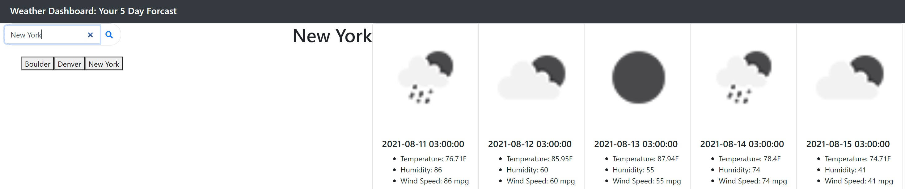

# Weather Dashboard

## Description

A Javascript-powered Weather Dashboard that displays your 5 day forcast for a searched area.

## Installation & Access

To access the project, visit my [GitHub Pages](https://patrickbrown-io.github.io/weather-dashboard-application/)

## Usage

Feel free to use this tool to plan your business day!

## Credits

[Patrick Brown](https://github.com/patrickbrown-io)

## Features

-Bootstrap Layout
-jQuery
-Local Storage
-Open Weather API

## How to Contribute

Send me a message with recommendations on how to build out the applicaiton! Would love to add in more features.
